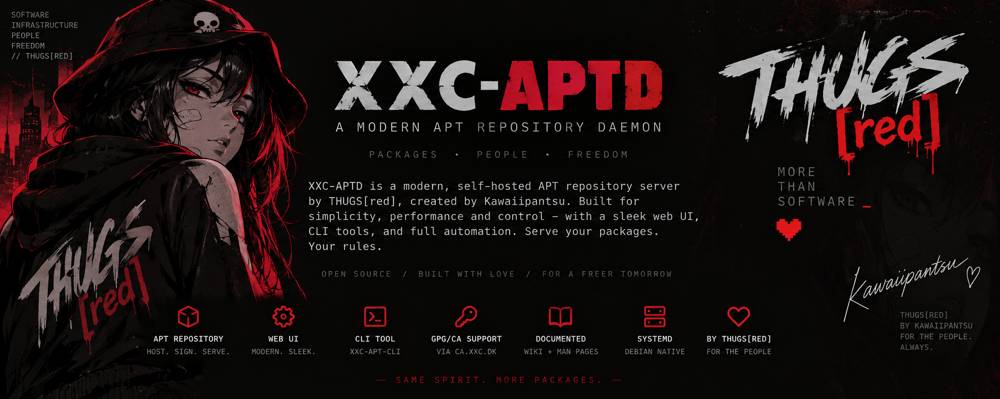
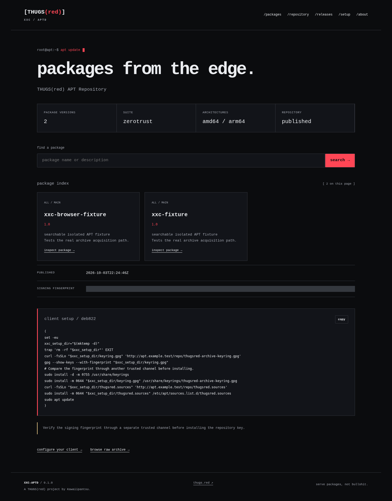
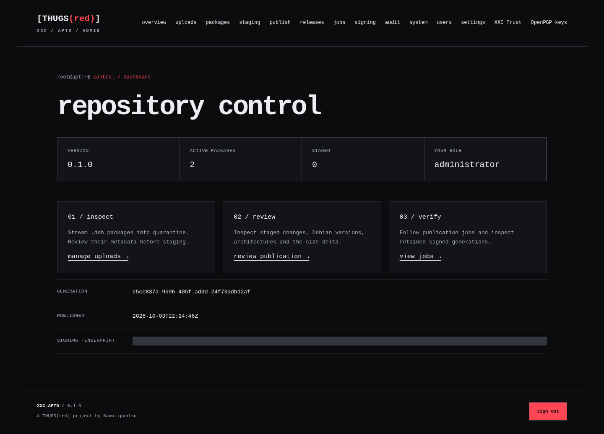
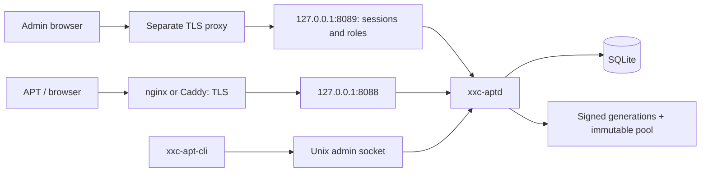

<div align="center">



**Signed packages. Atomic publications. Infrastructure with attitude.**

A Debian APT repository daemon, local administration CLI and searchable package browser.

<samp>Rust · plain HTTP · systemd · OpenPGP · TLS at your reverse proxy</samp>

[**THUGS(red)**](https://thugs.red) · [**Documentation**](docs/INSTALLATION.md) · [**Roadmap**](docs/ROADMAP.md) · [**Discussions**](https://github.com/kawaiipantsu/apt.thugs.red/discussions)

</div>

## What is XXC-APTD?

XXC-APTD is a **THUGS(red) project by Kawaiipantsu**, built as the next generation
of the infrastructure behind `apt.thugs.red`. It preserves the `/repo` archive
contract and `zerotrust main` while adding a staged, verifiable publication
workflow and a human-friendly public interface.

**Development status: 0.1.0.** Signed binary repositories, Unix administration,
the public browser and authenticated web administration are implemented. Local
users, roles, reviewed publication and session revocation are supported.
Automated retention/refresh, managed key controls, package removal and production
migration acceptance remain on the [roadmap](docs/ROADMAP.md).

## Screenshots

| Public repository | Administration |
| --- | --- |
|  |  |

See the [screenshot gallery](docs/SCREENSHOTS.md) for package details, directory
browsing, remote key management, publication review and mobile layouts.
Images use disposable fixture data. Regenerate them locally with `make screenshots`.

## Architecture



| Interface | Default | Purpose |
| --- | --- | --- |
| Public HTTP | `127.0.0.1:8088` | APT, package UI, setup, browser |
| Admin HTTP | `127.0.0.1:8089` | Authenticated web administration and API |
| Management | `/run/xxc-aptd/admin.sock` | Versioned API and CLI |
| Configuration | `/etc/xxc/aptd.conf` | Authoritative TOML; restart after changes |

## Build and try it

On a Debian development machine, install the [build prerequisites](docs/DEVELOPMENT.md).
As a normal user:

```sh
make build-release
./target/release/xxc-aptd --config "$PWD/.build/demo/aptd.conf" init --root "$PWD/.build/demo"
./target/release/xxc-aptd --config "$PWD/.build/demo/aptd.conf" config check
./target/release/xxc-aptd --config "$PWD/.build/demo/aptd.conf" serve
```

From a second terminal:

```sh
curl http://127.0.0.1:8088/
./target/release/xxc-apt-cli --socket "$PWD/.build/demo/run/admin.sock" status
```

Configure an explicit signing fingerprint using [SIGNING.md](docs/SIGNING.md).
Upload, inspect and stage a package, then publish and inspect the returned job:

```sh
xxc-apt-cli upload add ./package.deb
xxc-apt-cli upload inspect PACKAGE_ID
xxc-apt-cli upload stage PACKAGE_ID
xxc-apt-cli repo diff
xxc-apt-cli repo publish --review-token TOKEN_FROM_DIFF
xxc-apt-cli jobs show JOB_ID
```

`make test-integration` creates a temporary signing key, builds a fixture, starts
the daemon, uploads/stages/publishes it, and performs a real isolated APT
update and package download. It also tests interrupted publication, failed
signing, rollback, retained by-hash, ranges, conditionals and path attacks.

## Install on a repository server

Build the Debian package with `make deb`. As root:

```sh
apt install ./dist/xxc-aptd_*.deb
xxc-aptd config check
systemctl enable --now xxc-aptd
xxc-apt-cli status
```

Package installation creates the service account and required paths. It does
not generate a signing key. Configure the existing archive key before migrating
clients. Follow [installation](docs/INSTALLATION.md), [signing](docs/SIGNING.md)
and [reverse proxy](docs/REVERSE-PROXY.md) instructions. Manual installation uses
`make install` followed by `xxc-aptd init --system` and `systemctl daemon-reload`.

## Web administration

On the repository server, run `xxc-apt-cli user add archive-admin --role administrator`
as an authorized socket operator. The CLI prompts for the password without echo.
Set `[admin].external_url`, configure the [admin reverse proxy](docs/REVERSE-PROXY.md),
then open `/admin/login` on that origin. See [Administration](docs/ADMINISTRATION.md)
for local development settings, roles and the upload/stage/review/publish workflow.

## Documentation

| Guide | Contents |
| --- | --- |
| [Architecture](docs/ARCHITECTURE.md) | Crates, trust boundaries, transaction model |
| [Configuration](docs/CONFIGURATION.md) | Exact supported fields and validation |
| [Repository](docs/REPOSITORY.md) | Debian indexes, by-hash, generations |
| [API](docs/API.md) | Socket/HTTP endpoints, sessions and asynchronous jobs |
| [Administration](docs/ADMINISTRATION.md) | User bootstrap, roles and browser publication |
| [Operations](docs/OPERATIONS.md) | Publication, rollback, diagnostics |
| [Signing and rotation](docs/KEY-ROTATION.md) | OpenPGP trust continuity |
| [Backup/restore](docs/BACKUP-RESTORE.md) | Offline recovery procedure |
| [Debian packaging](docs/DEBIAN-PACKAGING.md) | Package build and ownership |
| [Release tooling](docs/RELEASES.md) | SemVer, artifacts, wiki, discussions |
| [Security](docs/SECURITY.md) | Threat model and reporting |
| [Verification](docs/VERIFICATION.md) | Passing checks and remaining acceptance gates |

Canonical documentation lives in `docs/`; wiki pages are generated from it.
Run `make ci` before submitting changes. See [CONTRIBUTING.md](CONTRIBUTING.md).

Developed by **Kawaiipantsu**. A **THUGS(red)** project.

`root@apt:~$ serve packages, not bullshit.`

## License

[MIT](LICENSE). Copyright © 2026 Kawaiipantsu / THUGS(red).

Optional [XXC Trust integration](docs/XXC-TRUST.md) uses systemd credentials and
verified outbound HTTPS. For direct trusted-network testing, see the
[wildcard listener configuration](docs/INSTALLATION.md).

[Remote signing](docs/SIGNING.md) keeps OpenPGP private keys in XXC Trust and
verifies returned APT signatures locally before atomic publication.
