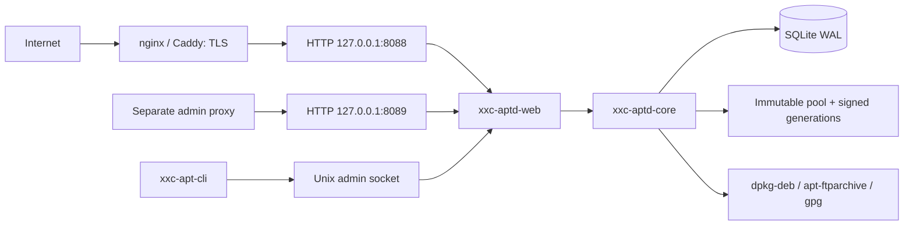

# XXC-APTD architecture

XXC-APTD is a THUGS(red) project by Kawaiipantsu. The target is a production
replacement for the repository at `https://apt.thugs.red/repo`. Version 0.1.0
is the first implementation slice, not a declaration of production readiness.
See [ROADMAP.md](ROADMAP.md) for implemented and outstanding acceptance gates.

## Processes and trust boundaries

One unprivileged Tokio process owns all listeners. Public routing cannot reach
management handlers. The administrative slice adds local Argon2id accounts,
expiring database sessions, viewer/operator/administrator roles and mandatory
CSRF/origin validation. Its acceptance tests are tracked in ROADMAP.md.
The first administrator is created through the mode 0660 Unix socket;
membership of its group grants full repository management authority.
There is no TLS listener. X.509 infrastructure identity and APT OpenPGP signing
are separate protocols; XXC Trust can provide both through distinct APIs. No proxy identity headers are accepted in this slice.

## Workspace

| Crate | Responsibility |
| --- | --- |
| xxc-aptd-core | Strict configuration, Debian adapters, state, ingest, signing, generations |
| xxc-aptd-web | Axum routing, streaming transfers, Askama pages, public/private separation |
| xxc-aptd | Process lifecycle, initialization, logging, listener supervision |
| xxc-apt-cli | Typed CLI using the versioned management API over Unix HTTP |
| xtask | Version, documentation, wiki and release maintenance |

Core has no Axum dependency. UI and CLI call the same management services.
Assets are compiled into the binary. No runtime Node, CDN, external font or
remote script is required. HTML uses a system monospace stack, dark surfaces,
red accents, visible focus and responsive layouts inspired by the main
[THUGS(red) site](https://thugs.red), with original project iconography.

## Repository transaction

1. Stream an upload into a private, randomly named quarantine file with a limit.
2. Inspect it with `dpkg-deb`, validate identifiers, hash it and record metadata.
3. Require explicit staging and an explicit publish request.
4. Hold a single publisher permit. Snapshot staged and active package records.
5. Copy verified bytes into immutable Debian pool paths; conflicting identities
   are rejected. Architecture `all` is included in every configured binary index.
6. Build Packages, compressed indexes and SHA256/SHA512 by-hash objects in a new
   generation. Generate Release metadata using `apt-ftparchive`.
7. Sign Release locally with GPG or remotely with XXC Trust, using an explicitly
   configured fingerprint. Verify both detached
   and inline signatures, persist a manifest and fsync before activation.
8. Atomically replace the `dists` symlink. The filesystem pointer is authoritative;
   SQLite/search state is reconciled from its manifest after a restart.

Published pool objects never change. Downloads take no publisher lock. Each
request resolves its generation once. A symlink switch cannot provide a
transaction across several separate HTTP requests; retained by-hash indexes
are therefore resolved across retained generations. This lets clients holding
an old Release retrieve the matching indexes after publication. Uncompressed
moving indexes require client checksum retry if publication overlaps a fetch.

Failed builds never replace the active pointer. Rollback validates a retained
manifest and signatures before switching. Pool reclamation is deferred until
reference-aware GC is implemented; disk use grows safely in this slice.

## State and failure handling

SQLite migrations run before serving, with WAL, foreign keys and a busy timeout.
Management records include packages, generations, jobs and audit events.
Filesystem manifests contain enough package metadata to recover publication
state independently of the database. Long-running publishing is a bounded job;
the job records failure, and the previous generation remains available.
Interrupted jobs are marked failed on restart. Upload scratch files are never
public. External tools use explicit argv, bounded output, deadlines and checked
exit status; package input never enters a shell command.

Configuration is authoritative and read-only during normal service operation.
Initialization uses create-new semantics and never generates or replaces keys.
Sensitive diagnostics stay off public routes. APT compatibility preserves
`/repo`, `zerotrust main`, `thugsred.gpg.key`, repository-specific Signed-By,
and both modern Deb822 and legacy source definitions.

## Production gates

Real isolated APT update/download tests, failure injection, traversal tests and
rollback tests are required for the first repository slice. Managed web
key administration, package removal, automatic metadata refresh,
reference-aware GC, tested upgrades/restores, browser accessibility and an
independent security review remain explicit gates before production 1.0.

## Administrative security and publication review

Authentication lives in core, with no Axum dependency. Session bearer values are
256 random bits and only their SHA-256 digests are stored. Cookies are host-only,
HttpOnly and SameSite=Strict, with Secure when either external origin uses HTTPS.
HTTPS installations use a __Host- cookie prefix. Role changes, password changes,
disabling and deletion invalidate sessions immediately. Anonymous login uses a
short-lived single-use CSRF challenge and generic failures; bounded Argon2 work
and durable per-account/per-peer attempt windows limit guessing. Forwarded
identity/client-IP headers never affect authentication or throttling.

HTML forms and JSON clients share the same management services and actor audit
context. Every mutating HTTP request must match the configured admin origin and
the session CSRF token. Multipart uploads validate the token before streaming
file bytes. The public router has no user/session routes. Unix administration
remains authorized through socket permissions, with no browser-cookie bypass
mounted on TCP. Configuration stays file-based and read-only.

A publication preview records the current generation, selected packages and
repository/signing configuration in a review digest. Publishing compares this
digest while holding the same permit used by staging. Stale review submissions
fail without scheduling a job. This review covers the currently implemented
additive package workflow; package removal remains separate roadmap work.

## Optional infrastructure inventory

`xxc-aptd-core::trust` supplies a bounded HTTPS client for XXC Trust
inventory, explicit OpenPGP generation and Debian Release signing. The daemon loads the token from a systemd credential, checks file
ownership/permissions, and retains a sensitive authorization header. The HTTP
listeners still use plain HTTP. Redirects, ambient HTTP proxies and invalid TLS
certificates are rejected. Responses use explicit field projections; private key
export and upstream owner/CSR fields have no route. Administrator UI, API and
CLI share the service and audit only operation/result metadata. Network outages
are isolated from public repository availability. New remote publications fail
without changing the active pointer. Verification and rollback import retained
public snapshots into isolated temporary keyrings; they require no CA access. See [XXC-TRUST.md](XXC-TRUST.md).

Public wildcard binds are supported. Administrative wildcard/non-loopback binds
require explicit `allow_remote` configuration, with the same session, role,
Host/Origin and CSRF checks. Defaults remain loopback for reverse-proxy use.

The signer trait is injected into the synchronous repository builder. The single
publication worker bridges the async Trust client through its Tokio runtime
handle, while HTTP remains responsive. It checks remote key status and the
fingerprint pin, validates the public-only export, requests signatures and then
verifies locally. API/UI/CLI expose no general signing oracle or private export.
