# Screenshot gallery

XXC-APTD 0.1.0, captured from the running application using disposable packages,
accounts, synthetic traffic and a local signing fixture. These images show the implemented interface;
remaining features are listed in the [roadmap](ROADMAP.md).

Desktop captures use a 1440-pixel viewport; mobile captures use 390 pixels.
Signing fingerprints are masked. Client setup commands use a reserved example
domain. No production account, credential, private key or internal address appears.
Run `make screenshots` to regenerate the captures; see [Development](DEVELOPMENT.md).

## Public repository

### Home

Repository status, search, recent packages and client setup.

### Package index and detail

| Searchable index | Package metadata and download |
| --- | --- |
| 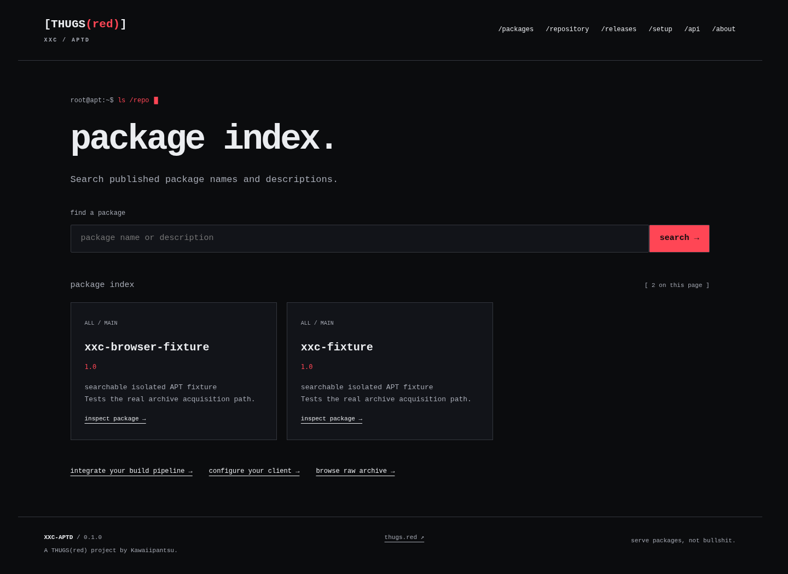 | 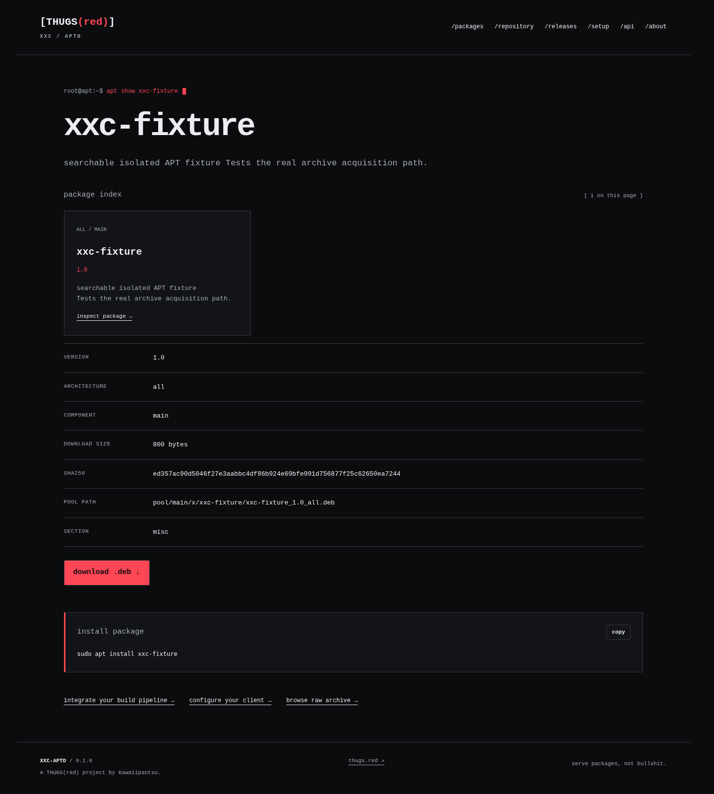 |

### Directory browser

Signed metadata remains available at its normal APT URL.

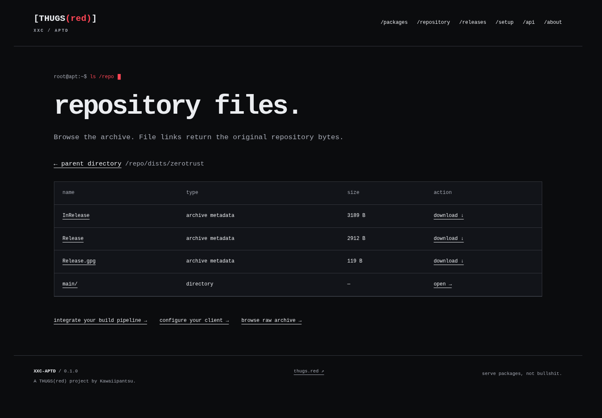

### Client setup

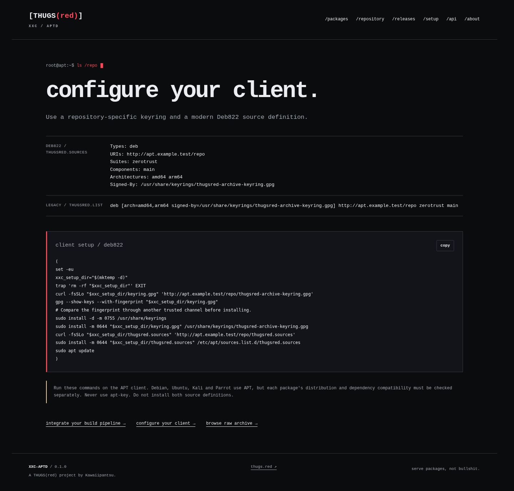

### Developer API guide

Public integration instructions, copyable examples and Markdown/OpenAPI downloads.
The first viewport is shown; the full page includes endpoint, retry and coding-agent guidance.

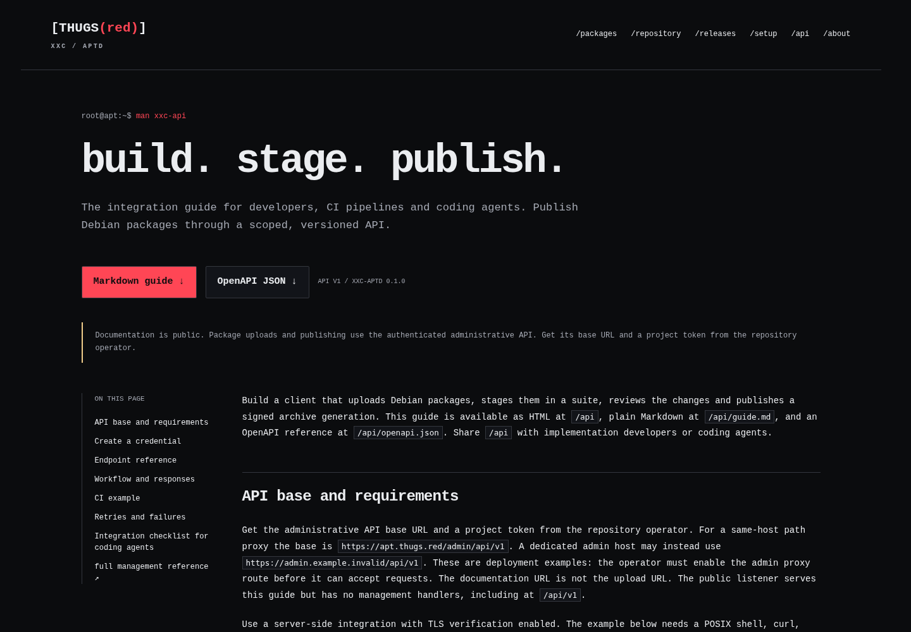

## Administration

### Login and dashboard

| Local account login | Repository control |
| --- | --- |
| 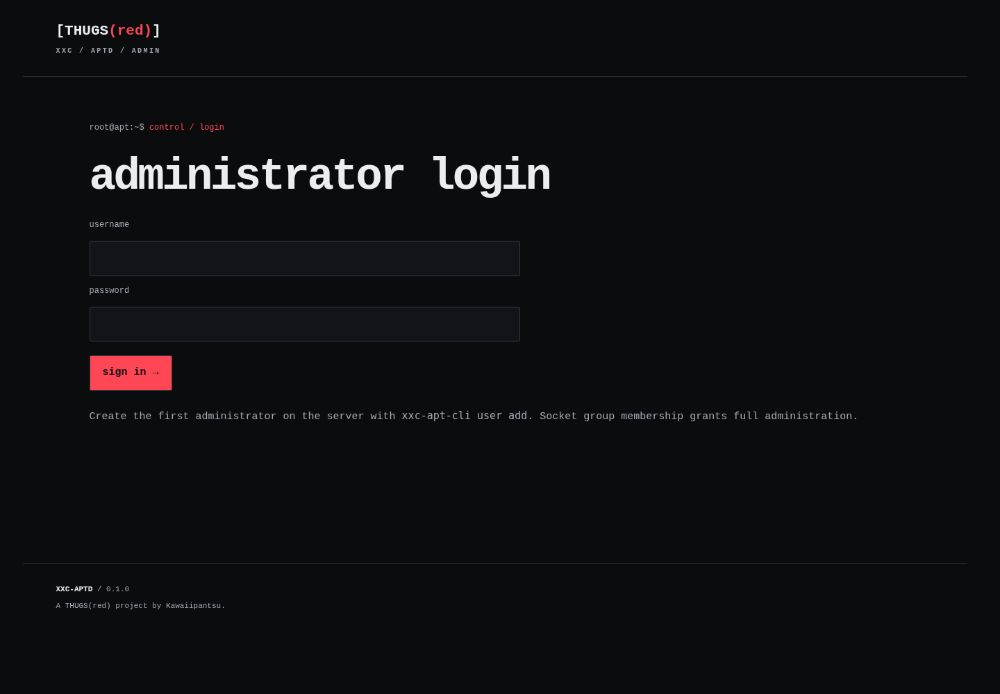 |  |

### Project API tokens

Administrators create expiring credentials with explicit permissions and suites.
No token value is included in these captures.

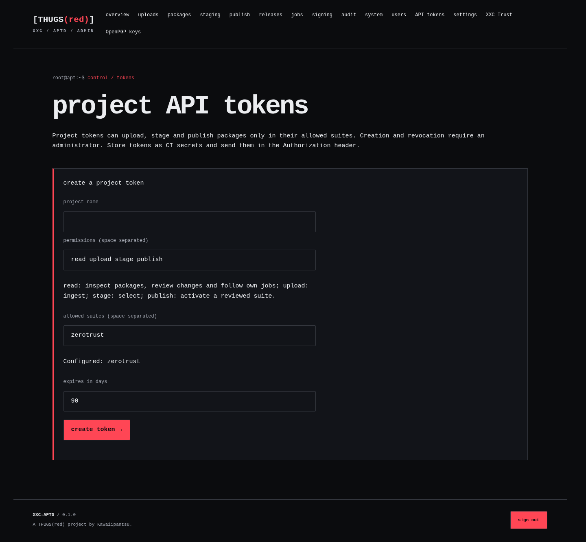

### Upload and review

| Inspected upload | Reviewed version upgrade |
| --- | --- |
| 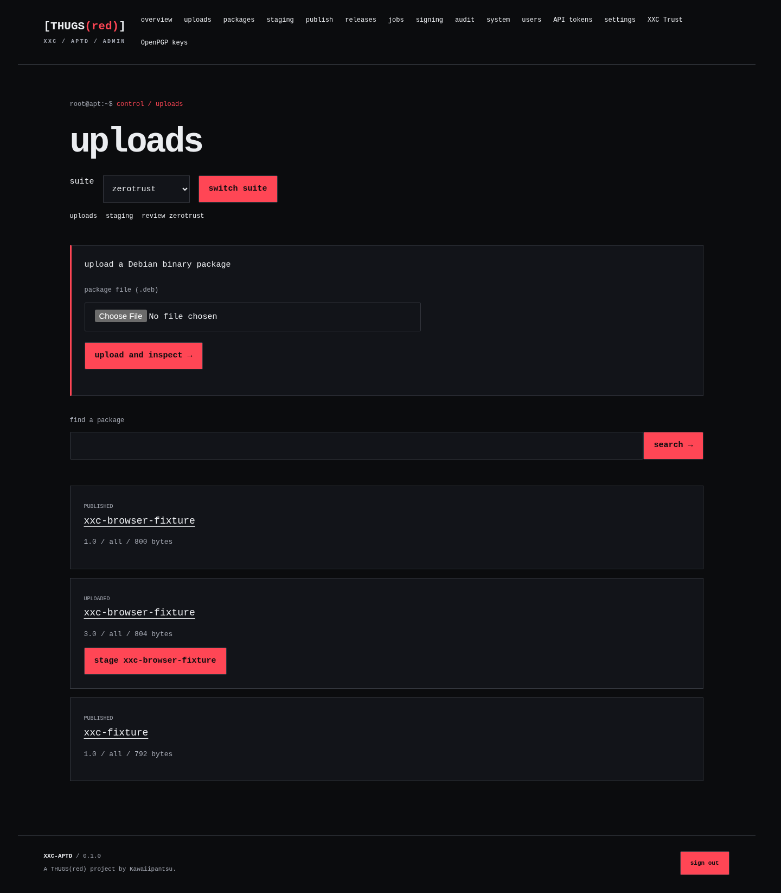 | 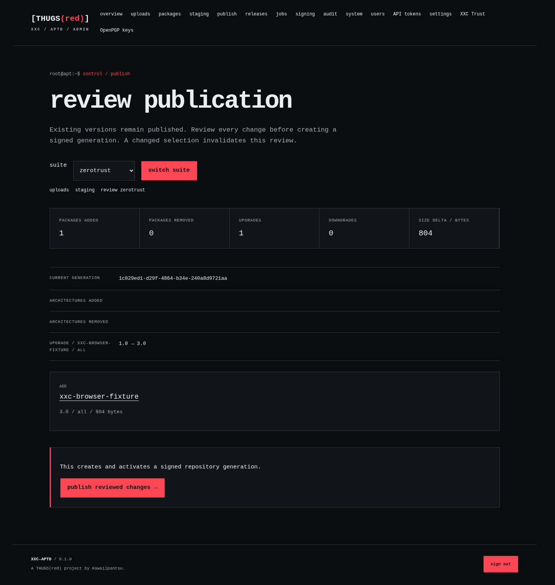 |

### Completed publication

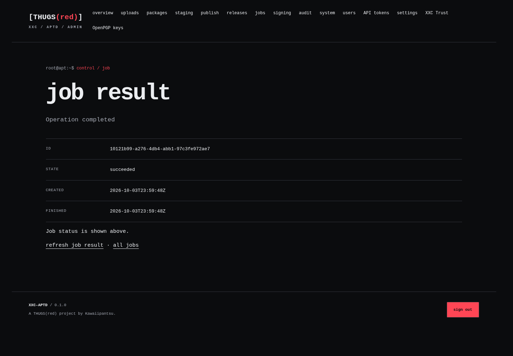

### Remote key management

Generation and public export through XXC Trust. Activation remains a separate,
explicit server configuration change.

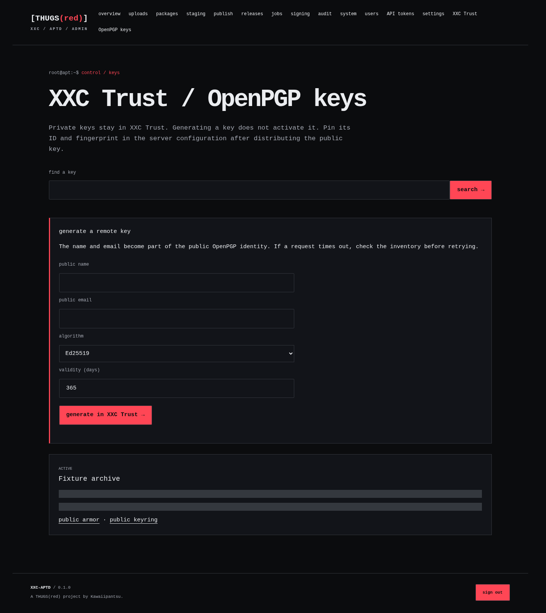

## Mobile

| Public home | Publication review |
| --- | --- |
| 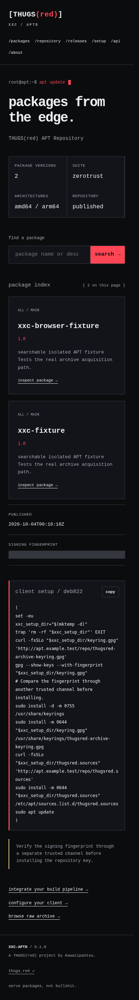 | 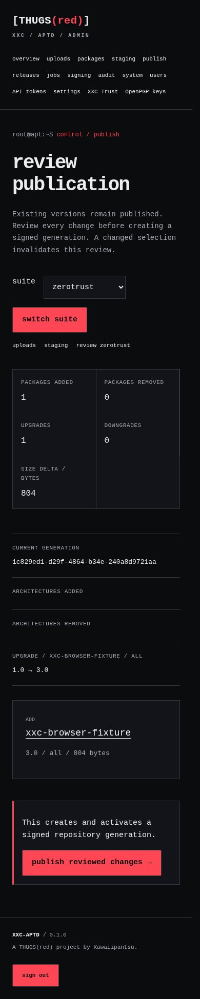 |

### Traffic on mobile

Charts and rankings below use synthetic history in a disposable fixture database.
The installed service records actual traffic only.

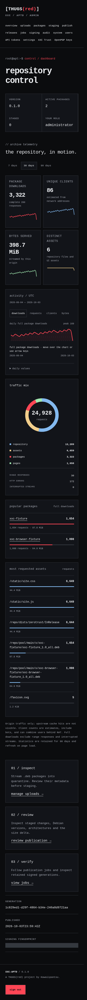
